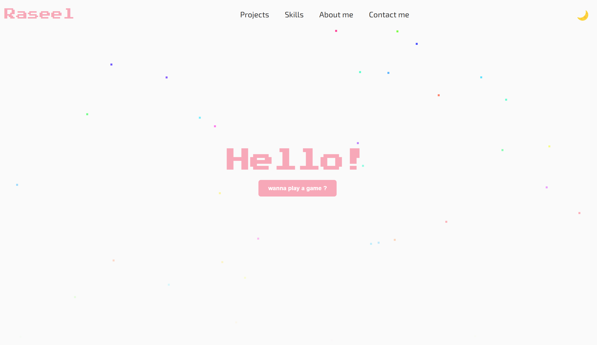

# Portfolio Website 🌐

A modern, responsive portfolio website. Built to showcase projects, skills, and personality.

## Features ✨

- **Theme Switching**: Toggle between light/dark modes
- **Responsive Design**: Mobile-first approach for all screen sizes
- **Custom Animations**: SVG path morphing and scroll-triggered effects
- **Skills Showcase**: Animated technical skills display

## Technologies Used 🛠️

- **Frontend**: HTML5, CSS3, JavaScript
- **Animations**: CSS Transitions/Keyframes
- **Icons**: Font Awesome 6
- **Fonts**: Google Fonts 
